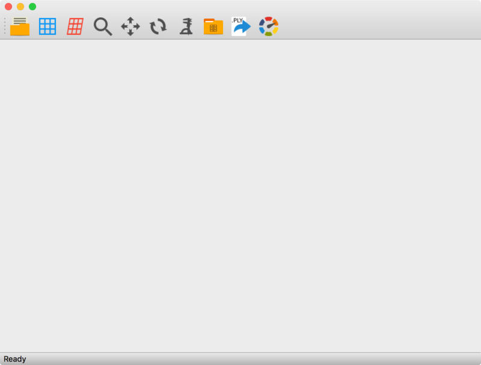
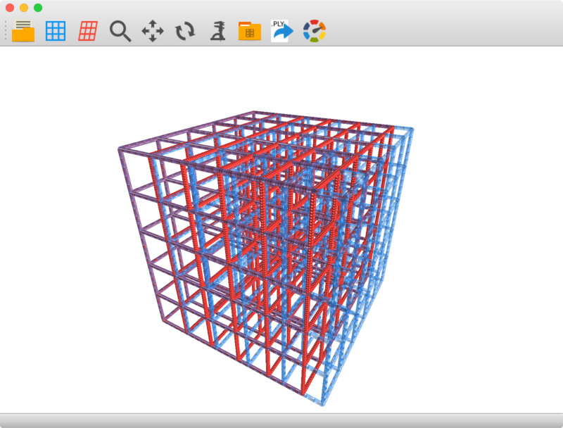

Tresta
======

Getting started
---------------
The project requires Qt and CMake. If not installed, please install both before continuing.

### To compile the code: ###
  1. Open the `tresta` root directory.
  2. create a folder named `build`.
  3. Open a terminal and navigate to the newly formed build directory.
  4. Execute `cmake .. -DCMAKE_PREFIX_PATH=/path/to/qt`.
    * By default this will build Tresta in release mode.
      Use `-DCMAKE_BUILD_TYPE=debug` if you would like to build the code for debugging purposes.
    * `-DCMAKE_PREFIX_PATH=/path/to/qt` tells CMake where to find the Qt installation.
      For example, on my computer this would be set to `/home/ryan/Qt/5.5/gcc_64`.
  5. On Linux run `make` in the terminal from the build directory to build all the targets. On Windows the solution file will be located in the build directory. Open the solution file in Visual Studio and compile.
  6. Upon successful compilation the tresta binary should be located in `build/bin/`

Introduction
------------
This program is used for visualization of 3D truss structures.
A truss is defined using CSV files to specify nodal positions,
connections between nodes (elements), elemental properties, and
(optionally) displacements. The path to each of these files is specified using
a JSON document. For example,

    {
        "nodes" : "/path/to/nodes.csv",
        "elems" : "/path/to/elems.csv",
        "props" : "/path/to/elems.csv",
        "colors" : "/path/to/colors.csv"
        "displacements" : "/path/to/displacements.csv"
    }

This configuration file is used by tresta to load the structure. After launching
the tresta binary, open a valid configuration file to display the structure.
The `"nodes"`, `"elems"`, and `"props"` keys must be present. The "displacements" and "colors" keys are optional. 
If `"displacements"` are provided then both the original and deformed truss structures are rendered.
The `"colors"` key can be used to set RGBA colors on an element-by-element basis. 
If not provided, a single color is used for the original and deformed meshes.

CSV files
---------
All CSV file must be comma delimited with no spaces between values, i.e. one row of the nodal coordinates file might resemble `1.0,2.0,3.0`.
### Nodes ###
The nodes CSV file specifies the `x, y, z` coordinate of each node in the truss.
The format should be:

    x1,y1,z1
    x2,y2,z2
    ...
    ...
    ...
    xN,yN,zN

where each entry is a floating point number and every line must have 3 entries for the `x,y,z` position.

### Elements ###
The elements CSV file specifies which nodes are connected. Each element is comprised
of two nodes, and each node is referenced by its index in the nodes CSV file, i.e.
if there a strut between the first and second node in `nodes.csv` the first line
in `elems.csv` would be `0,1`. Nodal indices are zero based and incremented by row.
The format of the element CSV file should be:

    el1_node_num_1,el1_node_num_2
    el2_node_num_1,el2_node_num_2
    ...
    ...
    ...
    elN_node_num_1,elN_node_num_2

### Properties ###
Elemental properties are the most complicated of the four possible JSON keys.
Each row must have 7 floating point values in the form:

    el1_EA,el1_EIz,el1_EIy,el1_GJ,el1_nvec_x_comp,el1_nvec_y_comp,el1_nvec_z_comp
    el2_EA,el2_EIz,el2_EIy,el2_GJ,el2_nvec_x_comp,el2_nvec_y_comp,el2_nvec_z_comp
    ...
    ...
    ...
    elN_EA,elN_EIz,elN_EIy,elN_GJ,elN_nvec_x_comp,elN_nvec_y_comp,elN_nvec_z_comp

`el1_EA` is the extensional stiffness of the first element, `el1_EIz` is the bending
stiffness about the z-axis, `el1_EIy` is the bending stiffness about the y-axis,
`el1_GJ` is the torsional stiffness, `el1_nvec_x_comp` is the x-component of element's
normal vector, `el1_nvec_y_comp` is the y-component of element's
normal vector, and `el1_nvec_z_comp` is the z-component of element's
normal vector. The normal vector is defined as vector of unit length pointing
along the beam's y-axis. Though it is complicated, in general a mesh generation
tool should be writing this file for you. If not, contact me, and we can figure
out how we could set a tool to write this file in an automated fashion.

### Colors ###
Explicitly setting the colors is optional. 
This is ideal when you need to set color on an element-by-element basis, e.g. applying a color map to the structure.
If the `"colors"` key is not provided original and deformed colors can be set after opening in the toolbar, but the color will be applied to the entire mesh.
Each row in the `colors.csv` file must have 4 floating point values on the range `[0.0,1.0]` specifying red, green, blue, and alpha values, respectively.
If the `"colors"` key is provided, then it must contain the same number of rows as the `"elems"` key, i.e. all elements must be given a color. 
For example if there are `N` elements, a sample `colors.csv` would have the form:

    r_el1,g_el1,b_el1,a_el1
    r_el2,g_el2,b_el2,a_el2
    ...
    ...
    r_elN,g_elN,b_elN,a_elN

### Displacements ###
Displacements are optional, but if provided allow visualization of the deformed
truss structure. This file will, in general, be computed by a finite element
analysis (see [threed-beam-fea](https://github.com/latture/threed-beam-fea)).
The format is such:

    dx_1, dy_1, dz_1, rx_1, ry_1, rz_1
    dx_2, dy_2, dz_2, rx_2, ry_2, rz_2
    ...
    ...
    ...
    dx_N, dy_N, dz_N, rx_N, ry_N, rz_N

where dx_1, dy_1, and dz_1 are the translational displacements applied to node 1
in the x-, y-, and z-directions, respectively, and rx_1, ry_1, rz_1 are nodal
rotations about each global coordinate axis.

### Example ###
After a successful build, launching the `tresta` binary will open a window
similar to:

Either pressing the open icon or clicking on the file menu and selecting open
will allow you to choose a configuration file. An example configuration file is
in the `examples` folder. Before opening with tresta, change the path specified
by `"nodes"`, `"elems"`, `"props"`, and `"displacements"` to the correct path on your
computer. By default the keys are specified relative to the default output path
of the tresta binary (assuming that you placed the build output in a subfolder
of the tresta root directory). If the executable is placed somewhere else,
tresta will not find the files without modifying the paths in `config.json`. 
After selecting to open the properly configured `config.json` file
the following should open:

The deformed shape is shown in red, and the original shape is shown in blue.
In the case of the example, this is the result of crushing the simple cubic
truss axially along the x-axis. For more information on specific controls
click the about dialog from the help menu of tresta.
